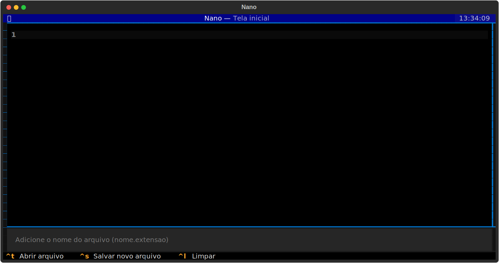
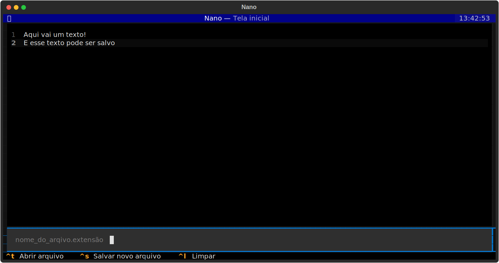

# Editor de textos utilizando Textual (Python)

Neste projeto, fiz uma releitura do Nano (editor de textos do Bash), utilizando Python e a biblioteca de interface gráfica Textual.

O software aceita a escrita de textos e é capaz de realizar a leitura e edição deles.
Para abrir e/ou salvar um arquivo, é necessário adicionar um nome de arquivo com uma extensão.

Comandos:
- Ctrl+t: abre o arquivo com o nome no Input
- Ctrl+s: salva o arquivo com o nome no Input
- Ctrl+l: limpa o conteúdo da área de texto

O projeto segue em desenvolvimento.